# Intelligent Observability & SRE Platform — Implementation Plan

> Full-stack observability covering metrics, logs, traces with SLO tracking and error budget management.

---

## Architecture Overview

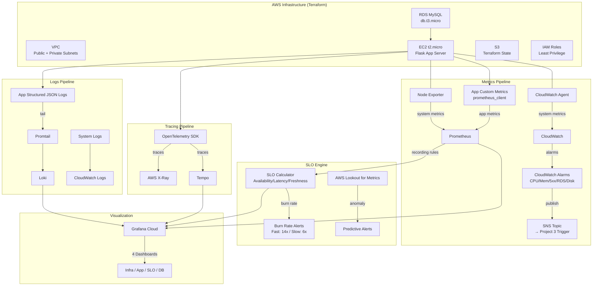

---

## Data Flow

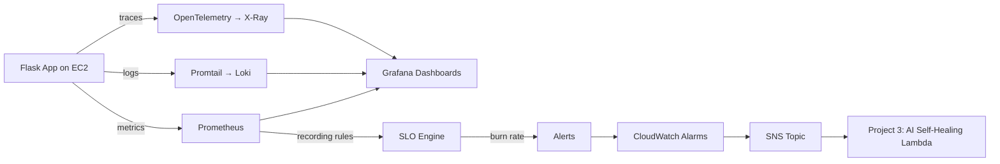

---

## Week-by-Week Execution

---

### WEEK 1 — Foundation Infrastructure with Terraform

**Goal:** Provision all AWS infrastructure and deploy a Flask app with realistic failure endpoints.

**Tech:** Terraform, AWS EC2, VPC, RDS MySQL, IAM, S3

#### Folder Structure
```
terraform/
├── main.tf
├── variables.tf
├── outputs.tf
├── terraform.tfvars
├── backend.tf
└── modules/
    ├── networking/
    │   ├── main.tf        # VPC, subnets, IGW, NAT, route tables
    │   ├── variables.tf
    │   └── outputs.tf
    ├── compute/
    │   ├── main.tf        # EC2, IAM role, instance profile, key pair, SG
    │   ├── variables.tf
    │   ├── outputs.tf
    │   └── userdata.sh    # Bootstrap script
    └── database/
        ├── main.tf        # RDS MySQL, subnet group, SG
        ├── variables.tf
        └── outputs.tf
```

#### Networking Module — What to Build
| Resource | Details |
|----------|---------|
| VPC | CIDR `10.0.0.0/16` |
| Public Subnets | 2 AZs, `10.0.1.0/24`, `10.0.2.0/24` — for EC2, IGW |
| Private Subnets | 2 AZs, `10.0.3.0/24`, `10.0.4.0/24` — for RDS |
| Internet Gateway | Attached to VPC |
| NAT Gateway | In public subnet for private subnet outbound |
| Route Tables | Public → IGW, Private → NAT |

#### Compute Module — What to Build
| Resource | Details |
|----------|---------|
| EC2 Instance | `t2.micro`, Amazon Linux 2, public subnet |
| Security Group | Inbound: 22 (SSH), 5000 (Flask), 9090 (Prometheus), 3100 (Loki) |
| IAM Role | `ec2-observability-role` with CloudWatch, X-Ray, S3 read policies |
| Instance Profile | Attach IAM role to EC2 |
| Key Pair | For SSH access |
| User Data | Install Python, Docker, Flask app dependencies |

#### Database Module — What to Build
| Resource | Details |
|----------|---------|
| RDS MySQL | `db.t3.micro`, private subnet, `observability_db` |
| DB Subnet Group | Both private subnets |
| Security Group | Inbound: 3306 from EC2 SG only |
| Parameters | `max_connections=100`, `slow_query_log=1` |

#### Flask App — Endpoints to Build
```
app/
├── app.py              # Main Flask application
├── requirements.txt
├── config.py
├── models.py           # SQLAlchemy models
├── routes/
│   ├── health.py       # GET /health — basic health check
│   ├── orders.py       # CRUD /api/orders — normal operations
│   └── chaos.py        # Failure simulation endpoints
└── utils/
    ├── logging_config.py
    └── metrics.py
```

**Failure Simulation Endpoints (routes/chaos.py):**

| Endpoint | What It Does |
|----------|-------------|
| `POST /chaos/cpu` | Spins CPU for N seconds (configurable) |
| `POST /chaos/memory` | Allocates large memory blocks, simulates leak |
| `POST /chaos/db-disconnect` | Drops DB connection pool, causes timeouts |
| `POST /chaos/slow-query` | Runs `SELECT SLEEP(N)` on MySQL |
| `POST /chaos/error-rate` | Returns 500 errors at configurable % rate |
| `GET /health` | Returns 200 + DB connectivity status |

#### Execution Flow
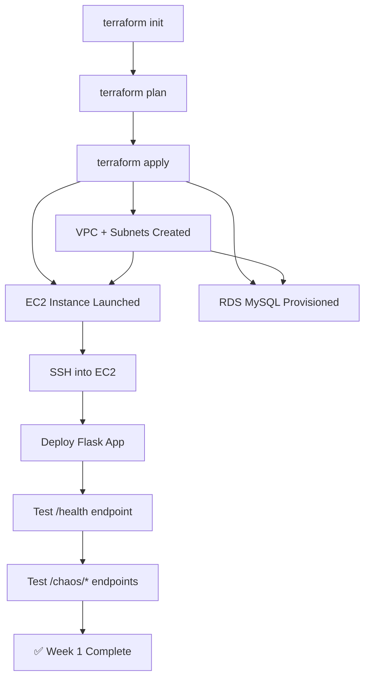

#### Verification
- [ ] `terraform apply` succeeds with no errors
- [ ] EC2 is reachable via SSH and public IP
- [ ] Flask app responds on port 5000
- [ ] `/health` returns `200` with DB status
- [ ] `/chaos/cpu` spikes CPU (verify with `top`)
- [ ] `/chaos/slow-query` causes visible latency
- [ ] RDS is accessible only from EC2 (not public)

---

### WEEK 2 — Metrics Pipeline (Prometheus + CloudWatch)

**Goal:** Collect system + app metrics, set up 5 CloudWatch alarms publishing to SNS.

**Tech:** Prometheus, Node Exporter, CloudWatch Agent, SNS, CloudWatch Alarms

#### What to Install on EC2
| Component | Purpose | Port |
|-----------|---------|------|
| Prometheus | Scrape & store metrics | 9090 |
| Node Exporter | System metrics (CPU, mem, disk, net) | 9100 |
| CloudWatch Agent | Push system metrics to CloudWatch | — |

#### Custom App Metrics to Add (app/utils/metrics.py)
```python
from prometheus_client import Histogram, Counter, Gauge

REQUEST_LATENCY = Histogram(
    'http_request_latency_seconds',
    'HTTP request latency',
    ['method', 'endpoint']
)
REQUEST_COUNT = Counter(
    'http_requests_total',
    'Total HTTP requests',
    ['method', 'endpoint', 'status']
)
DB_CONNECTIONS = Gauge(
    'db_active_connections',
    'Active DB connections'
)
DB_QUERY_DURATION = Histogram(
    'db_query_duration_seconds',
    'DB query execution time',
    ['query_type']
)
```

#### Metrics to Collect
| Category | Metrics |
|----------|---------|
| System | CPU %, Memory %, Disk I/O, Network bytes in/out |
| HTTP | Request rate, Error rate (4xx/5xx), Latency p50/p95/p99 |
| Database | Connection pool size, Active connections, Query duration |

#### Prometheus Config (prometheus.yml)
```yaml
global:
  scrape_interval: 15s
scrape_configs:
  - job_name: 'flask-app'
    static_configs:
      - targets: ['localhost:5000']
  - job_name: 'node-exporter'
    static_configs:
      - targets: ['localhost:9100']
```

#### 5 CloudWatch Alarms (All → SNS Topic)
| Alarm | Threshold | Period | Action |
|-------|-----------|--------|--------|
| High CPU | > 80% | 5 min | SNS |
| High Memory | > 85% | 5 min | SNS |
| HTTP 5xx Rate | > 5% | 5 min | SNS |
| RDS Connections | > 80% of max | 5 min | SNS |
| Disk Usage | > 90% | 5 min | SNS |

> **Critical:** All 5 alarms publish to the SAME SNS topic `observability-alerts`. This topic becomes the trigger for Project 3's AI self-healing Lambda.

#### Setup Flow
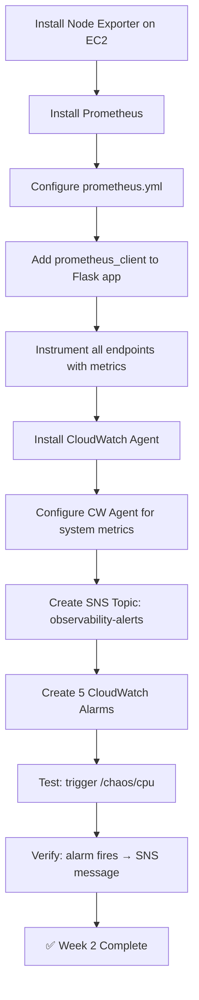

#### Verification
- [ ] Prometheus UI at `:9090` shows all targets UP
- [ ] Node Exporter metrics visible at `:9100/metrics`
- [ ] Custom app metrics appear in Prometheus
- [ ] CloudWatch shows system metrics for EC2
- [ ] SNS topic created with email subscription confirmed
- [ ] Trigger `/chaos/cpu` → CloudWatch alarm fires → SNS notification received

---

### WEEK 2–3 — Logs Pipeline (Loki + CloudWatch Logs)

**Goal:** Structured JSON logging, Loki + Promtail for log aggregation, queryable 5xx error logs.

**Tech:** Loki, Promtail, CloudWatch Logs, Structured JSON logging

#### Structured Log Format (Every Log Line)
```json
{
  "timestamp": "2026-05-13T10:23:41Z",
  "level": "ERROR",
  "request_id": "abc-123",
  "endpoint": "/api/orders",
  "method": "POST",
  "duration_ms": 4521,
  "status_code": 500,
  "error": "DB connection timeout after 3 retries",
  "trace_id": "xray-trace-id-here"
}
```

#### Logging Config (app/utils/logging_config.py)
- Use Python `logging` with custom JSON formatter
- Every request gets a unique `request_id` via middleware
- `trace_id` injected from OpenTelemetry context (Week 3)
- Log to file: `/var/log/flask-app/app.log`

#### What to Install
| Component | Purpose | Port |
|-----------|---------|------|
| Loki | Log aggregation & storage | 3100 |
| Promtail | Log shipper (tails app.log → Loki) | — |
| CloudWatch Logs Agent | System logs → CloudWatch | — |

#### Promtail Config
```yaml
server:
  http_listen_port: 9080
positions:
  filename: /tmp/positions.yaml
clients:
  - url: http://localhost:3100/loki/api/v1/push
scrape_configs:
  - job_name: flask-app
    static_configs:
      - targets: [localhost]
        labels:
          job: flask-app
          __path__: /var/log/flask-app/*.log
    pipeline_stages:
      - json:
          expressions:
            level: level
            status_code: status_code
            endpoint: endpoint
      - labels:
          level:
          status_code:
          endpoint:
```

#### Critical Loki Query — 5xx Errors in Last 5 Minutes
```logql
{job="flask-app"} | json | status_code >= 500 | line_format "{{.timestamp}} [{{.level}}] {{.endpoint}} — {{.error}}"
```
> **This exact query is used by Project 3's Lambda** to fetch relevant logs during an incident.

#### Setup Flow
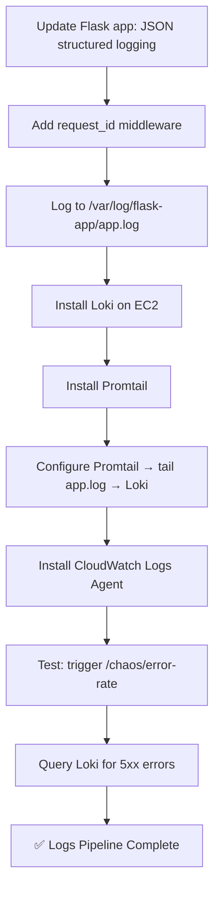

#### Verification
- [ ] App emits valid JSON logs to `/var/log/flask-app/app.log`
- [ ] Every log has `request_id`, `timestamp`, `level`, `status_code`
- [ ] Loki API at `:3100` is reachable
- [ ] Promtail is tailing logs (check Promtail targets page)
- [ ] Loki query returns 5xx errors after triggering `/chaos/error-rate`
- [ ] CloudWatch Logs shows system logs

---

### WEEK 3 — Distributed Tracing (OpenTelemetry + X-Ray)

**Goal:** Every request gets a trace_id. Traces show exactly where time is spent and where errors occur.

**Tech:** OpenTelemetry SDK, AWS X-Ray, Tempo

#### What to Instrument
```python
from opentelemetry import trace
from opentelemetry.sdk.trace import TracerProvider
from opentelemetry.sdk.trace.export import BatchSpanProcessor
from opentelemetry.exporter.otlp.proto.grpc.trace_exporter import OTLPSpanExporter
from opentelemetry.instrumentation.flask import FlaskInstrumentor
from opentelemetry.instrumentation.sqlalchemy import SQLAlchemyInstrumentor
from opentelemetry.instrumentation.requests import RequestsInstrumentor

# Auto-instrument
FlaskInstrumentor().instrument_app(app)
SQLAlchemyInstrumentor().instrument()
RequestsInstrumentor().instrument()

tracer = trace.get_tracer(__name__)
```

#### The Observability Triad
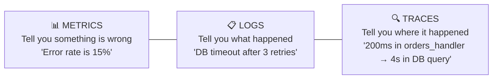

#### Trace Flow Through the App
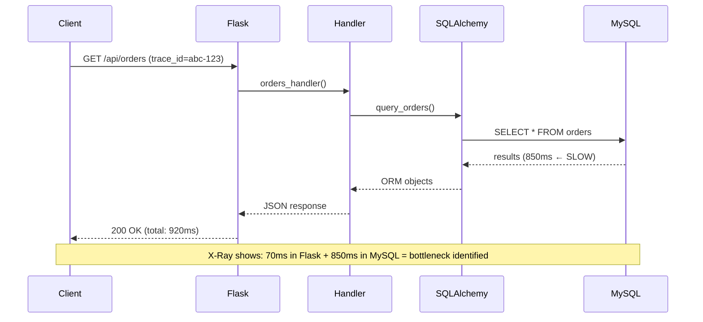

#### Setup Flow
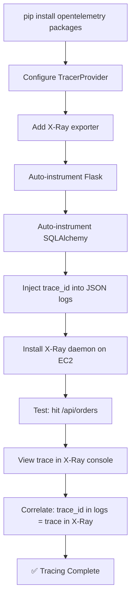

#### Verification
- [ ] Every request generates a trace visible in X-Ray console
- [ ] Trace shows Flask → Handler → SQLAlchemy → MySQL spans
- [ ] Slow queries show up as long spans in X-Ray waterfall
- [ ] `trace_id` appears in structured JSON logs
- [ ] Can search logs by `trace_id` to correlate logs ↔ traces

---

### WEEK 4 — SLO Engine + Error Budget Tracking

**Goal:** Define 3 SLIs, set SLO targets, track error budgets, alert on burn rate.

**Tech:** Prometheus recording rules, Grafana, Burn rate alerts

#### Your 3 SLIs and SLO Targets

| SLI | Definition | SLO Target | Error Budget (30d) |
|-----|-----------|------------|-------------------|
| Availability | `non-5xx requests / total requests` | 99.5% | 0.5% = ~3.6 hrs downtime |
| Latency | `requests < 500ms / total requests` | 95.0% | 5.0% = ~36 hrs slow |
| Freshness | `responses with data < 10min old / total` | 99.0% | 1.0% = ~7.2 hrs stale |

#### Prometheus Recording Rules (slo_rules.yml)
```yaml
groups:
  - name: slo-availability
    interval: 30s
    rules:
      - record: job:slo_availability:rate5m
        expr: >
          sum(rate(http_requests_total{status!~"5.."}[5m]))
          / sum(rate(http_requests_total[5m]))

      - record: job:error_budget_remaining:availability
        expr: >
          1 - (1 - job:slo_availability:rate5m) / (1 - 0.995)

  - name: slo-latency
    interval: 30s
    rules:
      - record: job:slo_latency:rate5m
        expr: >
          sum(rate(http_request_latency_seconds_bucket{le="0.5"}[5m]))
          / sum(rate(http_request_latency_seconds_count[5m]))

      - record: job:error_budget_remaining:latency
        expr: >
          1 - (1 - job:slo_latency:rate5m) / (1 - 0.95)
```

#### Burn Rate Alerts
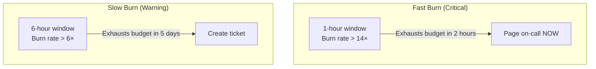

#### Burn Rate Alert Rules
```yaml
groups:
  - name: slo-burn-rate-alerts
    rules:
      - alert: HighErrorBudgetBurnRate_Fast
        expr: >
          1 - (sum(rate(http_requests_total{status!~"5.."}[1h]))
          / sum(rate(http_requests_total[1h]))) > (14 * 0.005)
        for: 2m
        labels:
          severity: critical
        annotations:
          summary: "Fast burn — budget exhausted in ~2 hours"

      - alert: HighErrorBudgetBurnRate_Slow
        expr: >
          1 - (sum(rate(http_requests_total{status!~"5.."}[6h]))
          / sum(rate(http_requests_total[6h]))) > (6 * 0.005)
        for: 5m
        labels:
          severity: warning
        annotations:
          summary: "Slow burn — budget exhausted in ~5 days"
```

#### Error Budget Policy
| Budget Remaining | Action |
|-----------------|--------|
| > 50% | Normal development velocity, deploy freely |
| 25–50% | Slow down risky deployments, increase review |
| 10–25% | Feature freeze, focus on reliability work only |
| 0% | Full stop on deploys until budget recovers |

#### Beast-Level Feature: AWS Lookout for Metrics
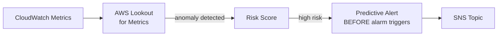
- Feed CloudWatch metrics (CPU, error rate, latency) into Lookout
- Lookout detects anomalous patterns that historically preceded SLO breaches
- Fires predictive alert BEFORE the CloudWatch alarm threshold is hit

#### Verification
- [ ] All 3 SLI recording rules produce values in Prometheus
- [ ] Error budget remaining is visible and correct
- [ ] Trigger `/chaos/error-rate` at 10% → see error budget drain
- [ ] Fast burn alert fires within minutes of high error injection
- [ ] Slow burn alert fires for sustained moderate error rate
- [ ] Lookout for Metrics configured and detecting anomalies

---

### WEEK 5 — Grafana Dashboards + Polish

**Goal:** 4 production dashboards, README with architecture diagram, demo recording.

**Tech:** Grafana Cloud (free tier), Dashboard JSON

#### 4 Dashboards

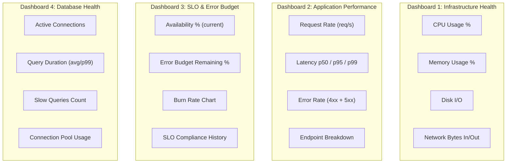

#### Grafana Cloud Free Tier Limits
| Resource | Limit |
|----------|-------|
| Active Metrics | 10,000 |
| Logs | 50 GB |
| Traces | 50 GB |
| Cost | $0 |

#### Demo Recording Script (90 seconds)
1. **0–15s:** Show all 4 Grafana dashboards in healthy state (green)
2. **15–30s:** Trigger `/chaos/error-rate?rate=30` — inject 30% error rate
3. **30–50s:** Watch App Performance dashboard go red, error rate spike
4. **50–65s:** Switch to SLO dashboard — show burn rate spike, budget draining
5. **65–80s:** Show CloudWatch alarm firing in AWS console
6. **80–90s:** Show SNS message received — "This triggers Project 3's AI self-healing"

---

## Complete Project Structure

```
Intelligent Observability and SRE Platform/
├── IMPLEMENTATION_PLAN.md          # This file
├── README.md                       # Project overview + screenshots
├── terraform/
│   ├── main.tf
│   ├── variables.tf
│   ├── outputs.tf
│   ├── backend.tf
│   ├── terraform.tfvars
│   └── modules/
│       ├── networking/
│       ├── compute/
│       └── database/
├── app/
│   ├── app.py
│   ├── config.py
│   ├── models.py
│   ├── requirements.txt
│   ├── Dockerfile
│   ├── routes/
│   │   ├── health.py
│   │   ├── orders.py
│   │   └── chaos.py
│   └── utils/
│       ├── logging_config.py
│       ├── metrics.py
│       └── tracing.py
├── observability/
│   ├── prometheus/
│   │   ├── prometheus.yml
│   │   └── slo_rules.yml
│   ├── loki/
│   │   └── loki-config.yml
│   ├── promtail/
│   │   └── promtail-config.yml
│   ├── grafana/
│   │   └── dashboards/
│   │       ├── infrastructure.json
│   │       ├── application.json
│   │       ├── slo-error-budget.json
│   │       └── database.json
│   └── cloudwatch/
│       ├── agent-config.json
│       └── alarms.tf
├── docker-compose.yml              # Local observability stack
├── scripts/
│   ├── deploy.sh
│   ├── setup-monitoring.sh
│   └── test-chaos.sh
├── runbooks/
│   ├── high-cpu.md
│   ├── high-error-rate.md
│   ├── db-connection-exhaustion.md
│   └── slo-budget-burn.md
└── docs/
    ├── architecture.md
    ├── slo-definitions.md
    └── error-budget-policy.md
```

---

## Full Tech Stack Summary

| Category | Technologies |
|----------|-------------|
| Infrastructure | Terraform, AWS EC2, VPC, RDS MySQL, IAM, S3 |
| Metrics | Prometheus, Node Exporter, CloudWatch Agent, CloudWatch Alarms |
| Logs | Loki, Promtail, CloudWatch Logs |
| Traces | OpenTelemetry SDK, AWS X-Ray, Tempo |
| SLO/SRE | SLI/SLO definitions, Error budgets, Burn rate alerts |
| Visualization | Grafana Cloud (4 dashboards) |
| Alerting | SNS, CloudWatch Alarms, Prometheus Alertmanager |
| ML/Predictive | AWS Lookout for Metrics |
| App | Python Flask, SQLAlchemy, Docker |
| CI/CD | GitHub Actions |

---

## Connection to Project 3 (AI Self-Healing)

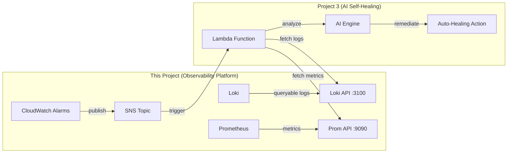

**What this project provides to Project 3:**
- **SNS Topic** — trigger events when alarms fire
- **Loki API** — query logs for incident context
- **Prometheus API** — query metrics for current state
- **Structured logs** — machine-parseable incident data
- **Trace IDs** — correlate across metrics/logs/traces

---

## LinkedIn Post Template

> "Built a full SRE observability stack with SLO tracking, error budgets, and burn rate alerts on AWS — the same reliability methodology Google uses.
>
> When error rate spikes, the system knows exactly how fast it's burning through its monthly reliability budget.
>
> Stack: Terraform | Prometheus | Loki | OpenTelemetry | X-Ray | Grafana | CloudWatch | AWS Lookout for Metrics
>
> Next: connecting this to an AI-powered self-healing system that automatically remediates incidents."

---

*Built with the SRE methodology from Google's Site Reliability Engineering handbook, Chapters 4-5.*
