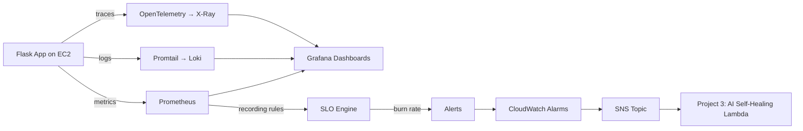

# Intelligent Observability & SRE Platform

> Full-stack observability layer with SLO engine, error budgets & burn rate alerts — built using Google's SRE methodology on AWS. The data backbone for AI-powered incident remediation.

## Overview
This repository contains a full-stack observability platform that covers metrics, logs, and traces. It acts as the critical data backbone required for automated, AI-driven self-healing systems. 

Built on AWS using Terraform, this platform collects and processes telemetry from a realistic application simulating real-world failure modes.

## Architecture & Data Flow

## Stack
*   **Infrastructure:** Terraform, AWS EC2, VPC, RDS MySQL
*   **Metrics:** Prometheus, Node Exporter, CloudWatch Agent
*   **Logs:** Loki, Promtail, CloudWatch Logs
*   **Traces:** OpenTelemetry SDK, AWS X-Ray
*   **SRE Core:** SLI/SLO tracking, Error budgets, Burn rate alerts
*   **Visualization:** Grafana Cloud

## Project Modules
1.  **Foundation Infrastructure (Terraform):** VPC, EC2, RDS
2.  **Metrics Pipeline:** Prometheus & CloudWatch
3.  **Logs Pipeline:** Loki & Promtail
4.  **Distributed Tracing:** OpenTelemetry & AWS X-Ray
5.  **SLO Engine:** Error budget tracking and burn-rate alerts
6.  **Dashboards:** Grafana integrations

*See `IMPLEMENTATION_PLAN.md` for a complete breakdown of the architecture, week-by-week implementation details, and runbooks.*
